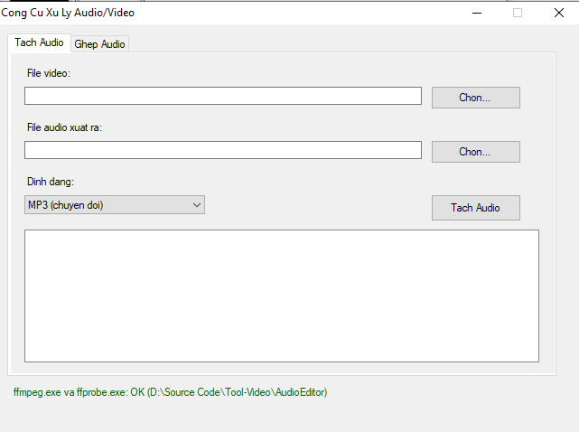

# AudioExtractorApp

<p align="center">
  
</p>

Ứng dụng WinForms VB.NET để tách audio ra khỏi file video, sử dụng ffmpeg.exe làm backend xử lý.

## Yêu cầu

- Windows có sẵn .NET Framework 4.x (có sẵn `vbc.exe` tại `C:\Windows\Microsoft.NET\Framework\v4.0.30319\vbc.exe`)
- File `ffmpeg.exe` **và** `ffprobe.exe` đặt cùng thư mục với file .exe sau khi build (xem hướng dẫn tải bên dưới). `ffprobe.exe` dùng để đọc thời lượng video/audio ở tab "Ghép Audio".

## Tải ffmpeg.exe và ffprobe.exe

Chương trình không đi kèm sẵn 2 file này (khá nặng), bạn cần tải riêng:

1. Vào trang: **https://www.gyan.dev/ffmpeg/builds/**
2. Ở mục "release builds", tải bản **`ffmpeg-release-essentials.zip`** (bản gọn nhẹ, đủ dùng)
3. Giải nén file zip vừa tải, vào thư mục con `bin`, sẽ thấy 3 file: `ffmpeg.exe`, `ffplay.exe`, `ffprobe.exe`
4. Copy **cả `ffmpeg.exe` và `ffprobe.exe`** ra, đặt vào cùng thư mục với `AudioExtractorApp.exe` (không cần `ffplay.exe`)

Nếu link trên không truy cập được, có thể tìm "ffmpeg builds windows gyan.dev" hoặc "ffmpeg builds windows BtbN" (BtbN là repo GitHub build ffmpeg tự động, tại https://github.com/BtbN/FFmpeg-Builds/releases) để tải bản thay thế.

## Build

Chạy `build.bat` (double-click hoặc trong cmd):

```
build.bat
```

Nếu máy bạn đặt .NET Framework ở đường dẫn khác, sửa biến `VBC` trong `build.bat` cho đúng.

Sau khi build xong sẽ có file `AudioExtractorApp.exe`. Copy `ffmpeg.exe` (đã tải ở bước trên) vào cùng thư mục này.

## Sử dụng

1. Mở `AudioExtractorApp.exe`
2. Bấm "Chọn..." ở dòng "File video" để chọn file video đầu vào
3. Chương trình sẽ tự gợi ý tên file audio xuất ra, bạn có thể đổi lại
4. Chọn định dạng audio:
   - **MP3 (chuyển đổi)**: chuyển sang MP3 chất lượng cao (VBR ~190kbps)
   - **AAC/M4A (giữ nguyên codec)**: nhanh, không giảm chất lượng, phù hợp với video MP4 (thường dùng AAC sẵn)
   - **WAV (PCM)**: audio không nén, dung lượng lớn nhưng chất lượng tối đa, dễ edit
   - **Giữ nguyên codec gốc (copy)**: không convert, chỉ tách nguyên luồng audio, nhanh nhất
5. Bấm "Tách Audio" và đợi kết quả, log tiến trình hiện ở khung bên dưới

## Ghi chú (tab Tách Audio)

- Nếu chọn "AAC/M4A" hoặc "Giữ nguyên codec gốc" mà video không có audio track tương thích với container đầu ra, ffmpeg có thể báo lỗi. Trong trường hợp đó chuyển sang MP3 hoặc WAV sẽ an toàn hơn (luôn convert được).

## Tab "Ghép Audio" — thay audio cũ bằng audio mới

Dùng khi bạn có sẵn video (có audio cũ) và muốn bỏ audio cũ, ghép audio mới vào.

1. Chọn **file video gốc**
2. Chọn **file audio mới** (sẽ thay thế hoàn toàn audio cũ trong video)
3. Chọn **nơi lưu video xuất ra** (chương trình tự gợi ý tên file `..._ghep_audio.mp4`)
4. Bấm **"Kiểm Tra Thời Lượng"**:
   - Chương trình dùng `ffprobe.exe` đọc thời lượng của cả 2 file
   - Nếu lệch nhau **trong khoảng 0.5 giây** → hiện chữ xanh **"OK"**
   - Nếu lệch **quá 0.5 giây** → hiện cảnh báo đỏ kèm số giây lệch cụ thể
5. Bấm **"Ghép Audio Vào Video"**:
   - Nếu thời lượng OK → ghép luôn
   - Nếu bị lệch → chương trình hỏi lại xác nhận trước khi ghép (audio có thể bị cắt cụt hoặc video bị im lặng ở cuối do lệnh `-shortest`)
   - Bắt buộc phải bấm "Kiểm Tra Thời Lượng" ít nhất 1 lần trước khi ghép được

Ngưỡng lệch cho phép (mặc định 0.5 giây) được khai báo ở hằng số `DURATION_TOLERANCE_SECONDS` trong file `AudioExtractorApp.vb`, có thể chỉnh lại nếu muốn chặt/lỏng hơn.

**Về định dạng file xuất ra:**
- Xuất ra `.mp4` → audio mới sẽ được encode lại sang AAC (đảm bảo tương thích), video giữ nguyên không encode lại
- Xuất ra `.mkv` → audio mới được giữ nguyên codec gốc (copy), không mất chất lượng, không giới hạn định dạng audio

## Ghi chú chung

- Chương trình chạy ffmpeg/ffprobe trên thread riêng để không treo giao diện.
- **Lưu ý bản quyền**: ffmpeg là phần mềm mã nguồn mở (LGPL/GPL tùy bản build), miễn phí sử dụng kể cả cho mục đích cá nhân/thương mại, nhưng file `ffmpeg.exe`/`ffprobe.exe` không được đóng gói kèm sẵn trong bộ mã nguồn này — bạn tự tải về theo hướng dẫn ở trên.
